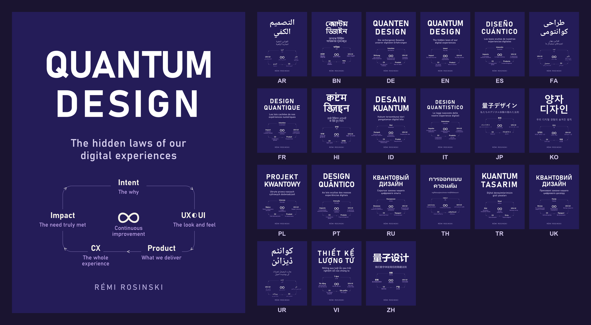

  

<h1 align="center">Quantum Expansive Design (QED)</h1>

<em>From the UX&nbsp;◐&nbsp;UI Big Bang to the Continuous Expansion of Experience Design</em>

<strong>The hidden laws of our digital experiences</strong>

  
  
  

---

**Quantum Expansive Design** is a framework that reads user experience through the lens of modern physics. It borrows metaphors from quantum mechanics and cosmology — entanglement, fields, fractal expansion, event horizons — and turns them into 8+1 practical laws for designing the digital experiences we live every day.

It is written for a wide audience: designers, product people, developers, founders — but also anyone simply curious about *why* our screens, apps and services feel the way they feel. You do not need to be an expert to read it.

> The premise: behind every interface there are hidden laws. Once you see them, you design differently.

## The loop at the heart of the book

> **Intent** (the why) → **UX ◐ UI** (the look and feel) → **Product** (what we deliver) → **CX** (the whole experience) → **Impact** (the need truly met) → **∞ Continuous improvement** ↩︎

A product is never "finished" — it expands. Each turn of the loop feeds the next.

## What's inside

- **Preface** — Explorers of Universes: from the infinitely vast to human experience
- **Introduction**
- **Cosmic Analogy** — from nebula to existing product
- **The 8+1 Fundamental Laws** of UX ◐ UI (see below)
- **The Rosinski Unified Field Equation (UFE-R)** — fusing UX "general relativity" and UI "quantum mechanics"
- **Thought Experiment** — the Conscious Ship
- **The Quantum Designer's Toolbox** — 7 categories of concrete tools
- **Toward the Infinity of Possibilities** — the era of AI-augmented design
- **Conclusion** — the odyssey of Quantum Expansive Design in the era of AI
- **Glossary of key terms**

### The 8+1 Fundamental Laws

| # | Law |
|---|-----|
| 0 | Founding Singularity UX ◐ UI: Origin, Entanglement, and Invisible Presence |
| 1 | Entanglement, Complementarity, and Duality in UX ◐ UI |
| 2 | Scalar Field and Contextual Modulation of UX |
| 3 | Fractal Expansion UX ◐ UI and Differentiated Evolutionary Rhythms in Design |
| 4 | Inter-Agent UX ◐ UI Accessibility and Cognitive Plurality |
| 5 | Emotional Resonance and Interaction Memory in UX |
| 6 | Transcendental Adaptability in UX ◐ UI and Systemic Openness |
| 7 | UX as a Living and Symbiotic Network |
| 8 | Invisible UX and the Event Horizon of Design |

### The Rosinski Unified Field Equation (UFE-R)

$$G_{QED}(t,d) = \frac{G_{UX/UI}}{c^{4}} \cdot T_{Exp}(t,\psi,d)$$

The geometry of the experience ($G_{QED}$) at a moment $t$ and across its dimensions $d$ is proportional to the intrinsic power of the design ($G_{UX/UI}$), divided by the speed of consciousness to the fourth power ($c^4$), driven by the energy-momentum tensor of the experience ($T_{Exp}$).

### The Quantum Designer's Toolbox

1. Founding Strategies and Methodologies
2. Research and Understanding Techniques
3. Information Modeling and Structuring Tools
4. Design Tools
5. Continuous Evaluation and Measurement Tools
6. Collaboration and Project-Management Tools
7. Intelligence and Anticipation Tools

Each tool is presented twice: its **classic role**, then its **quantum tuning** under QED — with concrete use cases, ethical guardrails, and an eye on where AI changes the picture.

## Read it

The book is available in **three formats** and **21 languages**, all free.

| Format | Folder |
|--------|--------|
| PDF | [`pdf/`](pdf/) |
| EPUB | [`epub/`](epub/) |
| Markdown | [`md/`](md/) |

Files follow the pattern `‹lang›-quantum-expansive-design-qed.‹ext›` — for example `en-quantum-expansive-design-qed.pdf`.

Cover images for every language live in [`png/`](png/) — `png/pdf/` (book ratio) and `png/epub/` (e-reader ratio).

> A web edition is in preparation.

## Editions — 21 languages

QED is fully translated into **21 languages**, each with its own localized title and tagline:

| Language | Title | Tagline |
|----------|-------|---------|
| English | Quantum Expansive Design | The hidden laws of our digital experiences |
| Français | Design Quantique Expansif | Les lois cachées de nos expériences numériques |
| Español | Diseño Cuántico Expansivo | Las leyes ocultas de nuestras experiencias digitales |
| Deutsch | Quantenexpansives Design | Die verborgenen Gesetze unserer digitalen Erfahrungen |
| Português | Design Quântico Expansivo | As leis ocultas das nossas experiências digitais |
| Italiano | Design Quantistico Espansivo | Le leggi nascoste delle nostre esperienze digitali |
| Bahasa Indonesia | Desain Kuantum Ekspansif | Hukum tersembunyi dari pengalaman digital kita |
| Tiếng Việt | Thiết kế Lượng tử Mở rộng | Những quy luật ẩn sau trải nghiệm số của chúng ta |
| Türkçe | Genişlemeci Kuantum Tasarım | Dijital deneyimlerimizin gizli yasaları |
| Polski | Ekspansywny Projekt Kwantowy | Ukryte prawa naszych cyfrowych doświadczeń |
| Русский | Квантовый расширяющийся дизайн | Скрытые законы нашего цифрового опыта |
| Українська | Квантовий Експансивний Дизайн | Приховані закони нашого цифрового досвіду |
| 中文 | 量子扩展设计 | 我们数字体验背后的隐藏法则 |
| 日本語 | 量子拡張デザイン | 私たちのデジタル体験の隠れた法則 |
| 한국어 | 양자 확장 디자인 | 우리 디지털 경험의 숨겨진 법칙 |
| हिन्दी | विस्तारशील क्वांटम डिज़ाइन | हमारे डिजिटल अनुभवों के छिपे हुए नियम |
| বাংলা | কোয়ান্টাম এক্সপ্যান্সিভ ডিজাইন | আমাদের ডিজিটাল অভিজ্ঞতার লুকানো সূত্র |
| ไทย | การออกแบบเชิงควอนตัมแบบขยายตัว | กฎที่ซ่อนอยู่ของประสบการณ์ดิจิทัลของเรา |
| العربية | التصميم الكمي التوسعي | القوانين الخفية لتجاربنا الرقمية |
| فارسی | طراحی کوانتومی گسترشی | قوانین پنهان تجربه‌های دیجیتال ما |
| اردو | کوانٹم ایکسپینسیو ڈیزائن | ہمارے ڈیجیٹل تجربات کے پوشیدہ اصول |

The **French** edition (*Design Quantique Expansif*) is the source of truth; every other language is translated and kept aligned chapter by chapter. The acronym is localized too — **QED** in English and most languages, **DQE** in French, **DCE** in Spanish, **DEQ** in Portuguese.

## Who it's for

- **Designers & product people** — a new lens to question your craft
- **Developers & founders** — from idea to product, with the user at the center
- **Curious minds** — to finally understand the invisible rules of the things you use every day

## Author

**Rémi Rosinski** — creator of the Quantum Expansive Design framework.

## Support the project

This book is not sold — it is *appreciated*. If it inspired you, the best way to give back is to **share it, apply it, and improve it**. A donations chapter (crypto and others) is included at the end of the book for those who wish to support its continuation.

## License

To be confirmed by the author. The intent is a **free, freely shareable** work (a Creative Commons license such as CC BY-NC-SA is the likely direction). Until then, please share the book as-is and credit the author.

## Contributing

Spotted a typo, an awkward translation, or have an idea to make a law clearer? Open an issue or a discussion — improvement is, after all, the point of the loop.

---

<em>UX = User Experience&nbsp;&nbsp;|&nbsp;&nbsp;UI = User Interface&nbsp;&nbsp;|&nbsp;&nbsp;CX = The whole experience</em>

